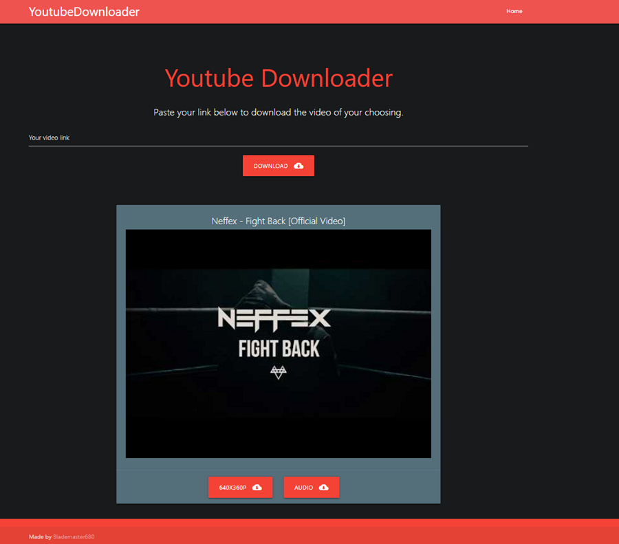

# YoutubeDownloader
 
## Info
This is a Youtube Downloader I created that allows you to download videos directly from YouTube. It is created in Django Web-Framework   and Pafy which is a Python Library to grab the Stream Data from the YouTube URL.

## How To Install
1. Make sure Python is installed
```
python --version
```

2. Clone the repository to the folder you would like it stored in.
```
git clone <Repository Clone URL>
```

3. Run pip install on the requirements.txt file to install all the needed dependencies.
```
pip install -r requirements.txt
```

4. Open the YoutubeDownloader folder and rename
```
example_settings_local.py to settings_local.py
```

5. Insert your YouTube Data API key from https://developers.google.com/youtube/v3 into settings_local.py: 
```
YOUTUBE_API_KEY = '<Your API Key>'
```

6. Run Django and goto your localhost:8000
```
python manage.py runserver
```

## Example Image

